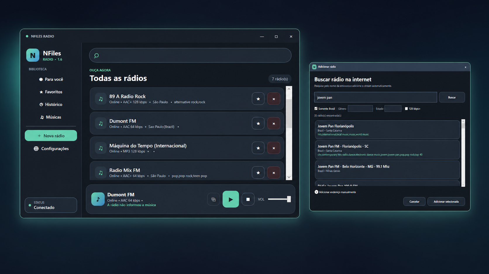
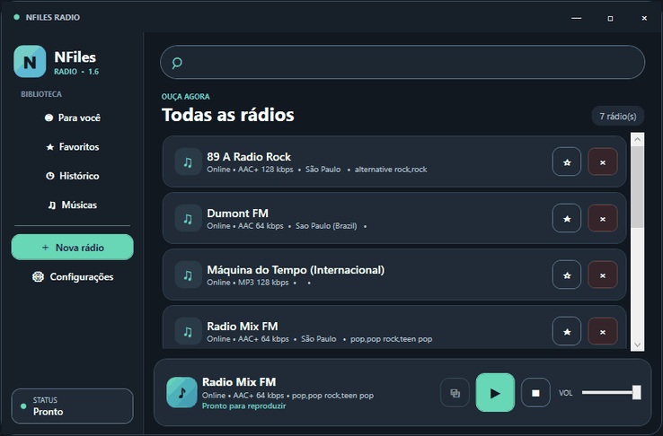

# NFiles Radio

<p align="center">
  
</p>

<p align="center"><strong>Seu rádio, do seu jeito.</strong><br>Player gratuito, moderno e leve para Windows 10 e 11.</p>

<p align="center">
  <a href="https://github.com/neurofiles1982-hub/NFiles-Radio-Downloads/releases/latest"><strong>Baixar versão mais recente</strong></a> ·
  <a href="https://github.com/neurofiles1982-hub/NFiles-Radio-Downloads/issues">Relatar um problema</a> ·
  <a href="https://github.com/neurofiles1982-hub/NFiles-Radio-Downloads/discussions">Comunidade</a>
</p>

## Conheça o NFiles Radio

O NFiles Radio permite pesquisar e ouvir estações de internet sem depender de navegador incorporado. O aplicativo organiza favoritos, registra estações e músicas ouvidas e continua tocando discretamente pela bandeja do Windows.

<p align="center">
  
</p>

## Principais recursos

- Pesquisa por nome, gênero, cidade, estado e país.
- Favoritos, histórico e estações personalizadas.
- Identificação da música quando a emissora fornece metadados.
- Reconexão automática em falhas temporárias do stream.
- Bandeja do Windows com Play/Pause, volume, favoritos e temporizador.
- Identidade visual escura consistente com a marca NFiles.
- Teclas multimídia, notificações opcionais e início minimizado.
- Backup de estações e favoritos.

## Versão 1.6 — Windows Experience

A versão 1.6 amplia a integração com o Windows:

- identidade visual escura preservada e refinada;
- inicialização opcional minimizada;
- reprodução em segundo plano configurável;
- controles pelas teclas multimídia;
- favoritos diretamente no menu da bandeja;
- melhorias de confiabilidade e persistência do volume.

Veja todas as mudanças no [histórico de versões](CHANGELOG.md) e os próximos estudos no [roadmap público](ROADMAP.md).

## Instalação segura

1. Abra a página de [Releases](https://github.com/neurofiles1982-hub/NFiles-Radio-Downloads/releases/latest).
2. Baixe `NFilesRadio-Setup.exe` e `NFilesRadio-Setup.exe.sha256`.
3. Confira a integridade no PowerShell:

```powershell
(Get-FileHash .\NFilesRadio-Setup.exe -Algorithm SHA256).Hash.ToLowerInvariant()
```

Compare o resultado com o arquivo `.sha256`. Não baixe instaladores publicados fora deste repositório ou da Microsoft Store.

## Requisitos

- Windows 10 ou Windows 11
- Processador x64
- Conexão com a internet

## Privacidade e suporte

O NFiles Radio não exige conta, não exibe anúncios e não inclui telemetria própria. Leia a [Política de Privacidade](PRIVACY.md), consulte o [Suporte](SUPPORT.md) e nunca publique dados pessoais ou detalhes exploráveis de segurança em uma Issue.

> Este é o repositório público oficial de downloads e comunidade. O código-fonte é mantido em repositório privado.
