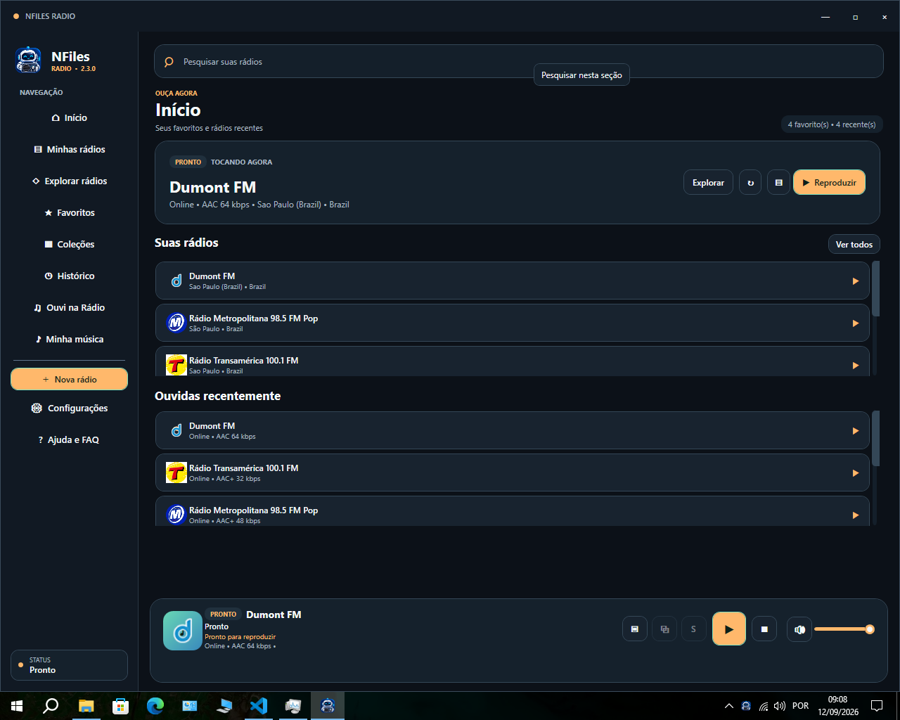
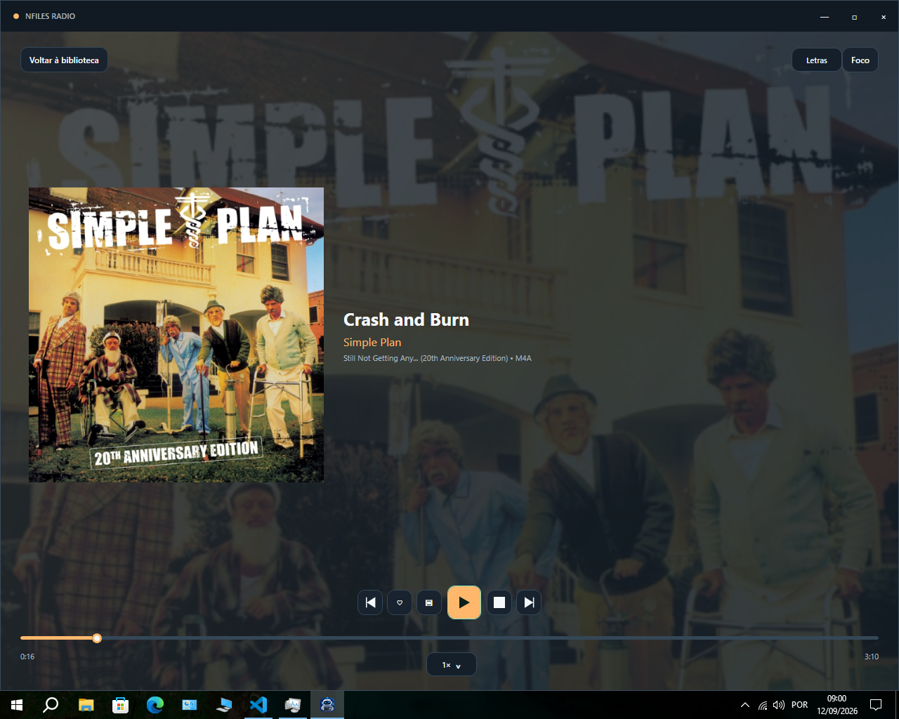
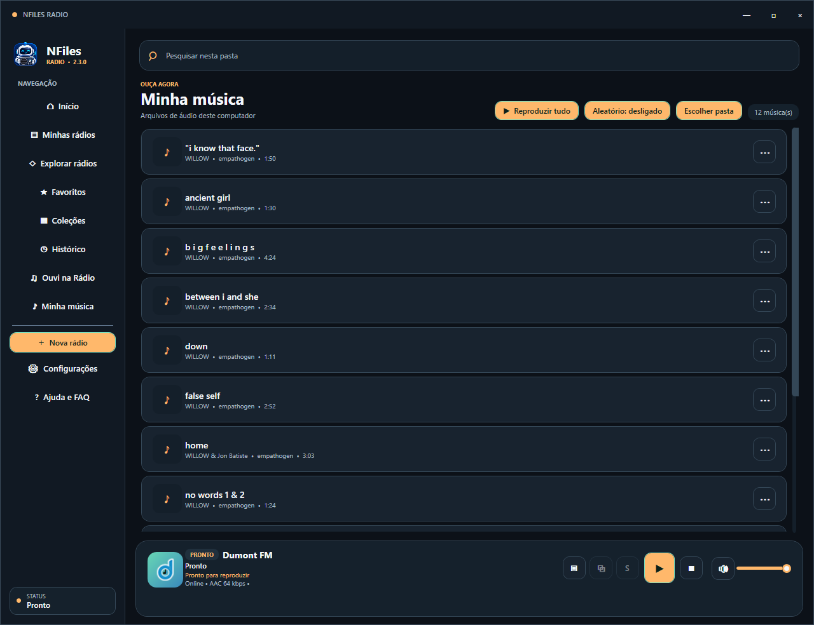
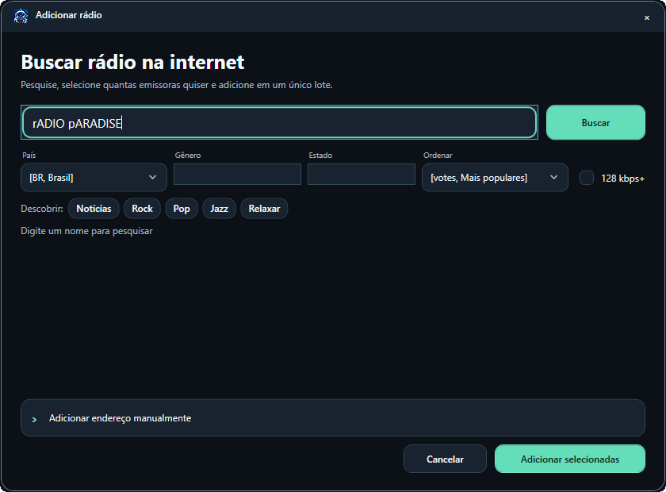
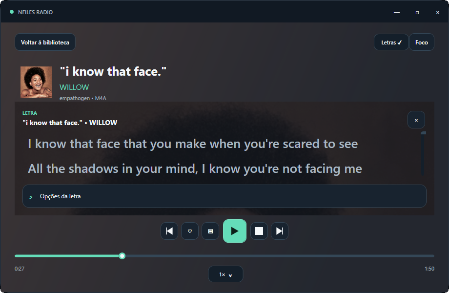

# NFiles Radio 2.3

<table>
  <tr>
    <td width="50%" align="center">
       
      <strong>Rádio online</strong> 
      Suas emissoras, favoritos e histórico em uma tela rápida e organizada.
    </td>
    <td width="50%" align="center">
       
      <strong>Player de música</strong> 
      Capa ampliada e translúcida em uma experiência imersiva.
    </td>
  </tr>
</table>

  <strong>Rádios do mundo e sua música local em uma experiência leve para Windows.</strong> 
  Gratuito, sem anúncios, sem conta obrigatória e sem telemetria.

  <a href="https://github.com/neurofiles1982-hub/NFiles-Radio-Downloads/releases/latest/download/NFilesRadio-Setup.exe"><strong>⬇️ BAIXAR PARA WINDOWS</strong></a>

  
  
  

## Rádio e música, sem complicação

| | O que o NFiles Radio oferece |
|---|---|
| **50 mil+ estações** | Pesquisa em um catálogo comunitário mundial com emissoras de mais de 200 países e territórios. |
| **Biblioteca expansível** | Salve e organize milhares de emissoras; cada arquivo de backup protegido aceita até 5.000 rádios. |
| **Dois players em um só app** | Rádio online e biblioteca de músicas locais na mesma interface, sem precisar alternar entre programas. |
| **100% gratuito** | Sem anúncios, assinatura, funções bloqueadas, conta obrigatória ou telemetria. |
| **Feito para ser leve** | Listas virtualizadas, capas e logotipos em cache e carregamento sob demanda do motor de música local. |
| **Pronto para usar** | Instalador autossuficiente de aproximadamente 78 MB: não exige a instalação separada do .NET. |

O catálogo consultado pelo aplicativo registrava **58.370 estações** e **241 países e territórios** em 12 de setembro de 2026. Como esse diretório público é atualizado continuamente, a quantidade e a disponibilidade das emissoras podem variar. [Consulte a documentação e as estatísticas do Radio Browser](https://docs.radio-browser.info/#server-stats).

## Feito para ouvir, descobrir e organizar

O NFiles Radio reúne estações online e arquivos de música do computador em um único aplicativo. A interface foi desenhada para permanecer clara e rápida inclusive em computadores mais modestos compatíveis, com reprodução em segundo plano, miniplayer, controles pela bandeja do Windows e reconexão automática para streams instáveis.

### Mais recursos em um aplicativo compacto

- Pesquisa de emissoras por nome, país, estado, gênero, qualidade e popularidade, com até 200 resultados relevantes por consulta.
- Capas e cards de estações, favoritos, histórico sem duplicações, coleções e rádios ouvidas recentemente.
- Reprodução local de MP3, FLAC, M4A, AAC, OGG, OPUS, WAV e WMA sem alterar os arquivos originais.
- Letras sincronizadas, Gapless, ReplayGain, fila, modo aleatório, velocidade e player imersivo.
- Temporizador para dormir, controles multimídia, bandeja do Windows, miniplayer e reprodução durante o descanso da tela.
- Temas claro, escuro e do sistema, quatro cores de destaque e densidades confortável ou compacta.
- Backup e restauração de rádios e favoritos, atualização automática visível e verificação SHA-256 dos instaladores.
- Cards compartilháveis com QR Code, Modo Descoberta, Surpreenda-me, estações semelhantes e recomendações locais.

### Destaques da versão 2.3

- Letras sincronizadas ao lado da capa ampliada, com destaque e rolagem automáticos.
- Fontes locais `.lrc`, letras incorporadas e `.txt`, além de busca opcional no LRCLIB.
- Clique em uma linha para avançar a música e ajuste persistente da sincronia.
- **Gapless:** transições contínuas entre músicas compatíveis, sem criar um segundo player concorrente.
- **ReplayGain:** volume equilibrado por faixa ou álbum, com proteção contra clipping.
- **Player imersivo:** capa da música aplicada ao fundo com transparência e contraste preservado.
- **Desempenho:** motor local carregado sob demanda e buffer ajustado para segundo plano.
- **Histórico confiável:** emissoras repetidas são consolidadas e não reaparecem após a exclusão.
- **Primeiro uso:** mensagem de boas-vindas com informações do projeto e contribuição opcional.
- **Janela maximizada:** todo o conteúdo e o player permanecem acima da barra de tarefas.
- **Atualização visível:** o usuário acompanha o fechamento da versão anterior e a instalação da nova.

- **Descoberta inteligente:** Surpreenda-me, estações semelhantes, recomendações locais e Modo Descoberta compacto.
- **Busca completa:** filtros por país, estado, gênero, qualidade e popularidade.
- **Informações da emissora:** idioma, codec, bitrate, localização, popularidade, site oficial e endereço do stream quando disponíveis.
- **Compartilhamento:** card em PNG com QR Code criado localmente, sem gravar ou redistribuir o áudio.
- **Biblioteca pessoal:** favoritos, histórico, coleções, rádios recentes e player de músicas locais.
- **Experiência Windows:** reprodução durante o descanso da tela, notificações, teclas multimídia, temporizador e bandeja do sistema.
- **Visual acessível:** temas claro, escuro e do sistema, quatro cores de destaque, densidade ajustável e controles com contraste revisado.
- **Privacidade por padrão:** sem anúncios, conta obrigatória ou telemetria; preferências e biblioteca permanecem no computador.
- **Instalação realmente limpa:** nenhum arquivo musical, rádio, favorito, histórico ou preferência de teste acompanha o aplicativo.

## Em breve

Integrações oficiais com **Spotify** e **YouTube** estão planejadas. Elas respeitarão as APIs, autenticação, direitos autorais e termos de cada plataforma. Acompanhe o escopo no [roadmap público](ROADMAP.md).

## Instalação

### Download direto

Baixe o [instalador oficial](https://github.com/neurofiles1982-hub/NFiles-Radio-Downloads/releases/latest/download/NFilesRadio-Setup.exe). O aplicativo verifica novas versões neste repositório e avisa quando uma atualização estiver disponível.

Confira a integridade do arquivo com o [SHA-256 publicado](https://github.com/neurofiles1982-hub/NFiles-Radio-Downloads/releases/latest/download/NFilesRadio-Setup.exe.sha256).

### Microsoft Store

O NFiles Radio está sendo preparado para uma nova avaliação da Microsoft Store. A página oficial da Store será atualizada após a aprovação.

> Use somente os downloads publicados em [Releases](https://github.com/neurofiles1982-hub/NFiles-Radio-Downloads/releases) ou a página oficial da Microsoft Store.

## Visão geral

<table>
  <tr>
    <td width="50%" align="center">
       
      <strong>Biblioteca leve e organizada</strong> 
      Pesquisa, capas, metadados e controles sempre acessíveis, mesmo com a janela maximizada.
    </td>
    <td width="50%" align="center">
       
      <strong>Encontre novas estações</strong> 
      Pesquisa funcional com filtros por país, gênero, estado, popularidade e qualidade.
    </td>
  </tr>
  <tr>
    <td width="50%" align="center">
       
      <strong>Letras sincronizadas</strong> 
      Destaque e rolagem automáticos sobre a arte translúcida, mantendo a leitura confortável.
    </td>
    <td width="50%" align="center">
       
      <strong>Player imersivo</strong> 
      Capa ampliada e translúcida, linha do tempo, velocidade e controles completos em uma tela limpa.
    </td>
  </tr>
</table>

## Requisitos

- Windows 10 versão 1809 ou mais recente, ou Windows 11, em computador x64.
- Funciona em PCs compatíveis sem placa de vídeo dedicada e sem exigir a instalação separada do .NET.
- Conexão com a internet para estações online, busca de capas e atualizações.
- Aproximadamente 500 MB de espaço disponível.

> **Windows 7 e 8.1:** a versão 2.3 não é compatível com esses sistemas. O aplicativo usa .NET 8, que não oferece suporte a Windows 7/8.1. Uma possível edição Legacy está em avaliação, separada da versão principal, para não reduzir a segurança e a estabilidade do aplicativo atual.

## Suporte e comunidade

- [Central de Ajuda](https://neurofiles1982-hub.github.io/NFiles-Radio-Downloads/)
- [Suporte](https://neurofiles1982-hub.github.io/NFiles-Radio-Downloads/support.html)
- [Perguntas frequentes](https://neurofiles1982-hub.github.io/NFiles-Radio-Downloads/faq.html)
- [Issues abertas e novos relatos](https://github.com/neurofiles1982-hub/NFiles-Radio-Downloads/issues)
- [Histórico de versões](CHANGELOG.md)

Ao relatar um erro, informe a versão do NFiles Radio, a versão do Windows, o resultado esperado e os passos para reproduzir. Não publique dados pessoais. Vulnerabilidades devem ser comunicadas pelo [canal privado de segurança](https://github.com/neurofiles1982-hub/NFiles-Radio-Downloads/security/advisories/new), nunca por uma Issue pública.

## Privacidade e licença

O aplicativo acessa a internet somente para os recursos solicitados, como pesquisar e reproduzir estações, obter capas e consultar atualizações. Arquivos de música, rádios, favoritos e preferências são mantidos localmente. Consulte a [Política de Privacidade](PRIVACY.md), a [Licença](LICENSE.txt) e os [avisos de terceiros](THIRD-PARTY-NOTICES.txt).

O NFiles Radio é freeware com código proprietário. O uso é permitido conforme os termos da licença; copiar, modificar, redistribuir ou vender o código e seus compilados não é autorizado.

---

  © 2026 NeuroFiles Technologies ME 
  CNPJ 38.182.471/0001-30

