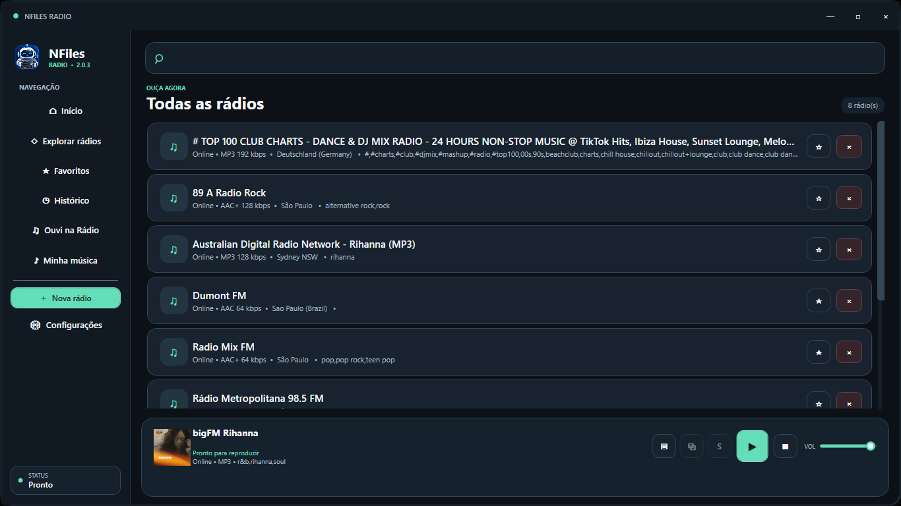
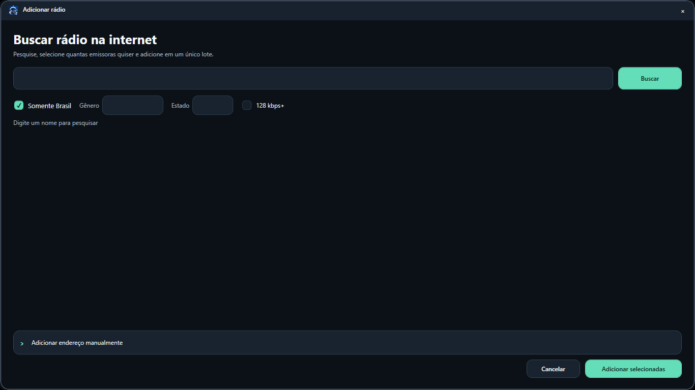
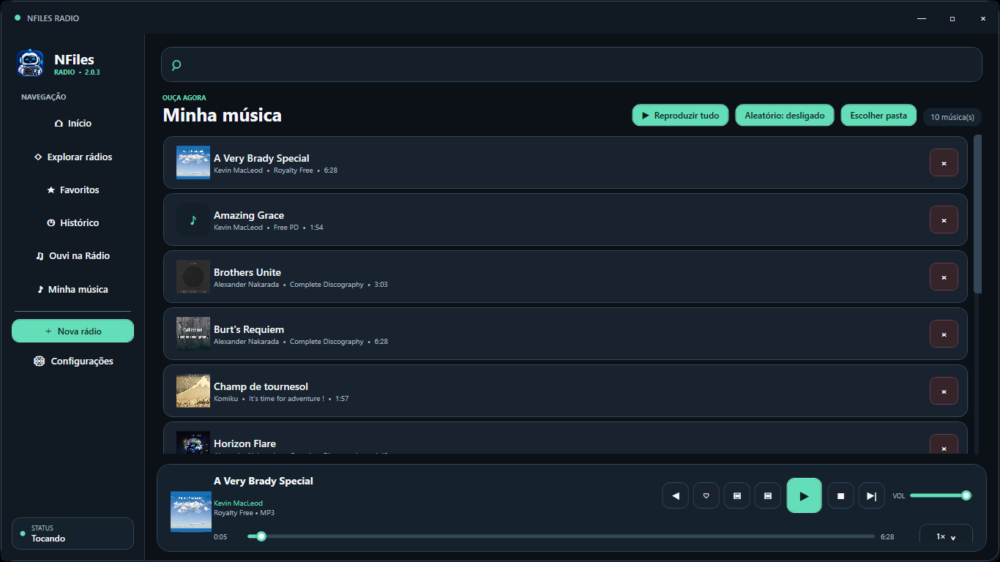
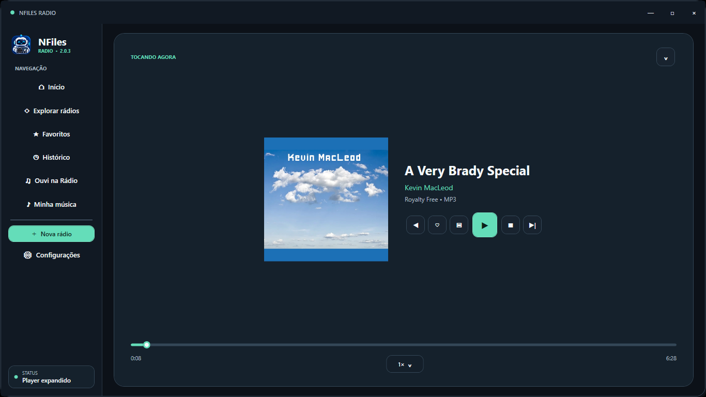

# NFiles Radio 2.2

  

  <strong>Rádios do mundo e sua música local em uma experiência leve para Windows.</strong> 
  Gratuito, sem anúncios, sem conta obrigatória e sem telemetria.

  <a href="https://github.com/neurofiles1982-hub/NFiles-Radio-Downloads/releases/latest/download/NFilesRadio-Setup.exe"><strong>⬇️ BAIXAR PARA WINDOWS</strong></a>

  
  
  

## Feito para ouvir, descobrir e organizar

O NFiles Radio reúne estações online e arquivos de música do computador em um único aplicativo. A interface foi desenhada para permanecer clara e rápida mesmo com bibliotecas grandes, com reprodução em segundo plano, miniplayer, controles pela bandeja do Windows e reconexão automática para streams instáveis.

### Destaques da versão 2.2

- Letras sincronizadas ao lado da capa ampliada, com destaque e rolagem automáticos.
- Fontes locais `.lrc`, letras incorporadas e `.txt`, além de busca opcional no LRCLIB.
- Clique em uma linha para avançar a música e ajuste persistente da sincronia.

- **Descoberta inteligente:** Surpreenda-me, estações semelhantes, recomendações locais e Modo Descoberta compacto.
- **Busca completa:** filtros por país, estado, gênero, qualidade e popularidade.
- **Informações da emissora:** idioma, codec, bitrate, localização, popularidade, site oficial e endereço do stream quando disponíveis.
- **Compartilhamento:** card em PNG com QR Code criado localmente, sem gravar ou redistribuir o áudio.
- **Biblioteca pessoal:** favoritos, histórico, coleções, rádios recentes e player de músicas locais.
- **Experiência Windows:** reprodução durante o descanso da tela, notificações, teclas multimídia, temporizador e bandeja do sistema.
- **Visual acessível:** temas claro, escuro e do sistema, quatro cores de destaque, densidade ajustável e controles com contraste revisado.
- **Privacidade por padrão:** sem anúncios, conta obrigatória ou telemetria; preferências e biblioteca permanecem no computador.

## Instalação

### Download direto

Baixe o [instalador oficial](https://github.com/neurofiles1982-hub/NFiles-Radio-Downloads/releases/latest/download/NFilesRadio-Setup.exe). O aplicativo verifica novas versões neste repositório e avisa quando uma atualização estiver disponível.

Confira a integridade do arquivo com o [SHA-256 publicado](https://github.com/neurofiles1982-hub/NFiles-Radio-Downloads/releases/latest/download/NFilesRadio-Setup.exe.sha256).

### Microsoft Store

O NFiles Radio está sendo preparado para uma nova avaliação da Microsoft Store. A página oficial da Store será atualizada após a aprovação.

> Use somente os downloads publicados em [Releases](https://github.com/neurofiles1982-hub/NFiles-Radio-Downloads/releases) ou a página oficial da Microsoft Store.

## Visão geral

<table>
  <tr>
    <td width="50%" align="center">
       
      <strong>Rádios e reprodução</strong> 
      Navegação direta, favoritos, metadados e controles sempre acessíveis.
    </td>
    <td width="50%" align="center">
       
      <strong>Encontre novas estações</strong> 
      Pesquise e adicione várias emissoras com filtros úteis.
    </td>
  </tr>
  <tr>
    <td width="50%" align="center">
       
      <strong>Sua música local</strong> 
      Biblioteca com capas e informações das faixas, sem alterar os originais.
    </td>
    <td width="50%" align="center">
       
      <strong>Player expandido</strong> 
      Arte em destaque, fila, linha do tempo e controles completos.
    </td>
  </tr>
</table>

## Requisitos

- Windows 10 versão 1809 ou mais recente, ou Windows 11.
- Computador x64.
- Conexão com a internet para estações online, busca de capas e atualizações.
- Aproximadamente 500 MB de espaço disponível.

## Suporte e comunidade

- [Central de Ajuda](https://neurofiles1982-hub.github.io/NFiles-Radio-Downloads/)
- [Suporte](https://neurofiles1982-hub.github.io/NFiles-Radio-Downloads/support.html)
- [Perguntas frequentes](https://neurofiles1982-hub.github.io/NFiles-Radio-Downloads/faq.html)
- [Issues abertas e novos relatos](https://github.com/neurofiles1982-hub/NFiles-Radio-Downloads/issues)
- [Histórico de versões](CHANGELOG.md)

Ao relatar um erro, informe a versão do NFiles Radio, a versão do Windows, o resultado esperado e os passos para reproduzir. Não publique dados pessoais. Vulnerabilidades devem ser comunicadas pelo [canal privado de segurança](https://github.com/neurofiles1982-hub/NFiles-Radio-Downloads/security/advisories/new), nunca por uma Issue pública.

## Privacidade e licença

O aplicativo acessa a internet somente para os recursos solicitados, como pesquisar e reproduzir estações, obter capas e consultar atualizações. Arquivos de música, rádios, favoritos e preferências são mantidos localmente. Consulte a [Política de Privacidade](PRIVACY.md), a [Licença](LICENSE.txt) e os [avisos de terceiros](THIRD-PARTY-NOTICES.txt).

O NFiles Radio é freeware com código proprietário. O uso é permitido conforme os termos da licença; copiar, modificar, redistribuir ou vender o código e seus compilados não é autorizado.

---

  © 2026 NeuroFiles Technologies ME 
  CNPJ 38.182.471/0001-30

